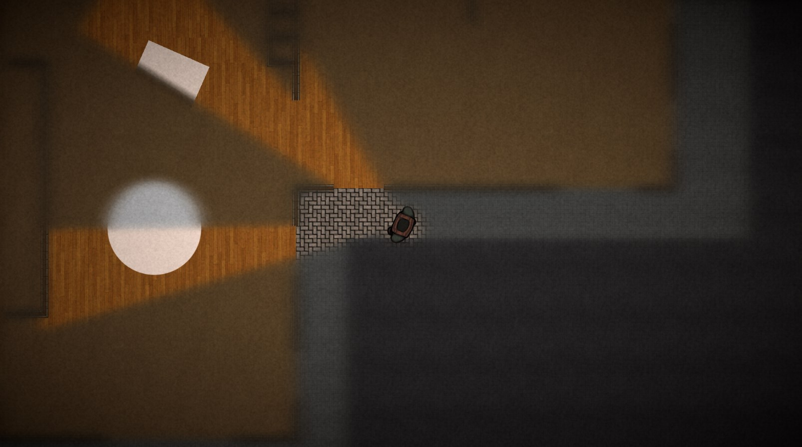
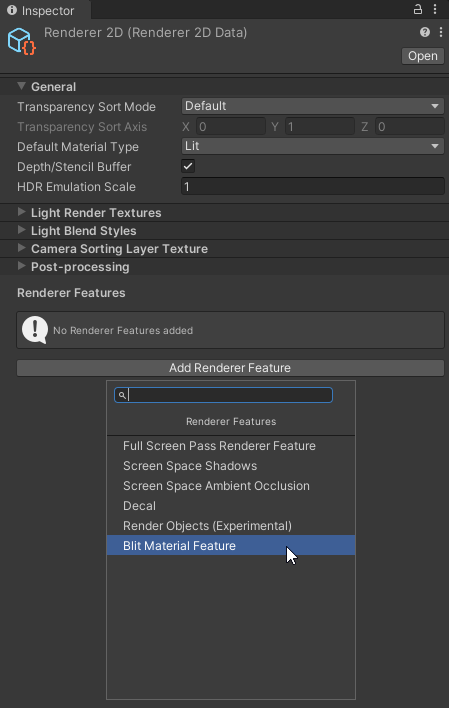
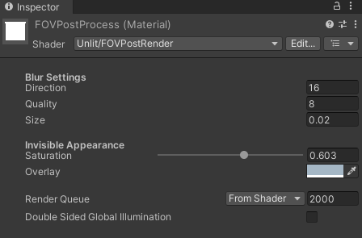
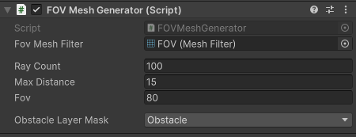

# Easy 2D FOV

<i> Note: Visual assets in this demonstration are not provided with the package </i>

This Unity package provides an appealing line of sight system that aims ease of use and modify. It is developed for URP and it works in both 2021 and 2022 versions of Unity.

## Features
- Line of Sight
- Hideable and visible objects
- Blur and overlay color for invisible areas

## Installation

1. You can either import the released Unity package or clone the repository and open it with Unity. The project is ready to use, so the following steps are not required, but reading can help you understand and edit it based on your requirements.

2. It works layer and camera based. Therefore, you need to 3 different cameras to render Environment, FOV and hideable entities. (There is an example prefab in project) Then, you need to set culling mask layers of your cameras.

3. System needs FOVCameraSetupManager script. It is already attached to existing FOVMainCamera prefab. If you set another camera for yourself, you have to attach this script and assign the references in the editor. FOV Camera should have black background and FOV should be white. (See the example scene and prefabs)

4. Create a Blit Render Feature in your URP Render Settings

5. Set the render feature's material to Post Process Material which is also included in the project.

After completing these steps and setting your object layers correctly, you must achieve the line of sight effect. You can use example scene for initial setup.

## Usage
### FOV Post Process Shader

This is the post process material applied to rendered frame. You can find it in Materials folder or create your own using the FOVPostProcess shader in Shaders Folder. 

Blur settings changes the quality and the amount of blur.

Invisible Appeareance section helps to set saturation and overlay color for invisibile areas.

### FOV Mesh Generator

FOVMeshGenerator generates an FOV Mesh and assigns it to target mesh filter. It uses raycasts to determine the visible area. This may not be the most optimal implemenetation for your game. It focuses on ease of use and aims to test the Line of Sight Effect.
